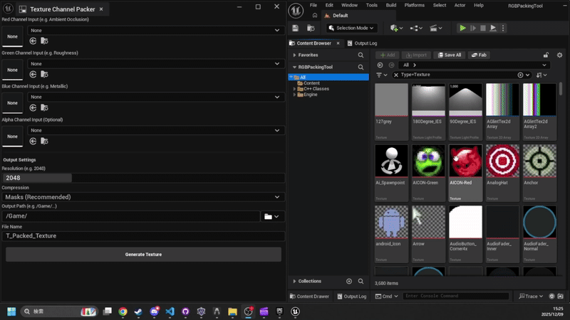

[English](QUICK_START.md)

# クイックスタートガイド

**テクスチャをパックするワークフロー**

## 1. インストール (簡易版)

1.  `TextureChannelPacker` フォルダをプロジェクトの `Plugins` ディレクトリにコピーします。
2.  Unreal Engine を再起動します。

## 2. ステップ・バイ・ステップ

### ステップ 1: ツールを開く
メニューの **Tools (ツール) > Texture Channel Packer** を選択します。

### ステップ 2: ドラッグ＆ドロップで入力
コンテンツブラウザから各スロットにテクスチャを直接ドラッグ＆ドロップします。
*   *ヒント:* 標準的な ORM レイアウトは **Red** = アンビエントオクルージョン、**Green** = ラフネス、**Blue** = メタリック です。

### ステップ 3: 確認と生成
1.  **Output File Name (ファイル名)** が自動生成されることを確認してください（スマート命名機能）。
2.  保存先を変更する場合は **フォルダアイコン** をクリックします。
3.  **Generate Texture** をクリックします。

## プロのヒント
*   空の R, G, B スロットは自動的に **黒 (0)** で塗りつぶされます。アルファチャンネルはデフォルトで **白 (255)** になります。
*   事前にテクスチャをリサイズする必要はありません。ツールが自動的に処理します。
*   ORM マップの場合、圧縮設定 (Compression) は `Masks` のままにしてください。
