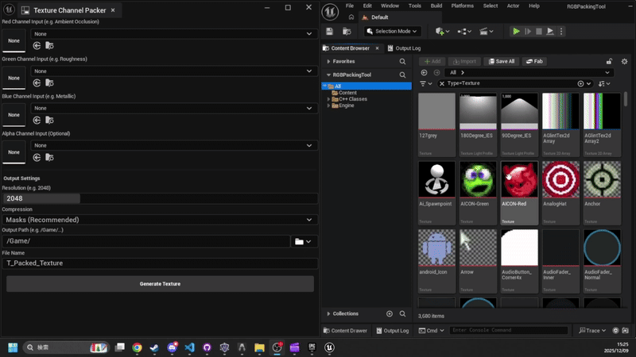

[日本語 (Japanese)](QUICK_START.ja.md)

# Quick Start Guide

**Zero to Packed Texture in 10 seconds.**

## 1. Installation

1.  Copy the `TextureChannelPacker` folder into your project's `Plugins` directory.
2.  Restart Unreal Engine.

## 2. Step-by-Step Workflow

### Step 1: Open the Tool
Go to **Tools > Texture Channel Packer**.

### Step 2: Pick a Preset (Optional)
Choose a **Preset** from the dropdown at the top to set channel labels, filename suffix, compression, and invert defaults in one click.
*   **ORM** (default): R = Ambient Occlusion, G = Roughness, B = Metallic — suffix `_ORM`.
*   **MRA**: R = Metallic, G = Roughness, B = Ambient Occlusion — suffix `_MRA`.
*   Use **Save As...** to store your own layout as a reusable preset (shared with your team via JSON files in `Saved/TextureChannelPacker/Presets/`).

### Step 3: Drag & Drop Inputs
Drag your textures directly from the Content Browser into the slots.
*   *Tip:* Standard ORM layout is **Red** = Ambient Occlusion, **Green** = Roughness, **Blue** = Metallic.
*   *Source Channel:* Each slot has an **R/G/B/A** dropdown to choose which channel to read from the input — handy for sourcing from a color or already-packed texture without splitting it first.

### Step 4: Preview (Optional)
Click **Update Preview** to see a low-resolution composite of the packed result before generating an asset.
*   Use the **View** dropdown to inspect the RGB composite or any single channel (R/G/B/A) as grayscale.

### Step 5: Verify & Generate
1.  Notice that the **Output File Name** is automatically generated (Smart Naming).
2.  Set the **Width** and **Height** for your output resolution (they can differ for non-square textures).
    > **Note:** Resolutions above 8192px will show a memory warning dialog before processing.
3.  Toggle **Invert** on any channel if you need to flip values (e.g., Roughness → Smoothness).
4.  Click the **Folder Icon** if you need to change the save location.
5.  Click **Generate Texture**. If an asset with the same name exists, a confirmation dialog will appear.

## Reverse Workflow: Unpack

Need the opposite? The **Unpack** tab splits a packed texture back into per-channel grayscale assets.

1.  Click **Unpack** in the switcher at the top of the tool window.
2.  Select the packed **Source Texture** — its R/G/B/A channels are previewed instantly in a 2×2 grid.
3.  Channels flagged **Uniform** (all pixels share one value → likely unused) are unchecked automatically; toggle any channel's checkbox to include/exclude it.
4.  Check the auto-generated **Base File Name** (`T_Rock_ORM` → `T_Rock`); each cell shows the final name with the preset's suffix (e.g., `T_Rock_AO`).
5.  Click **Unpack Textures**. One grayscale (G8) asset per selected channel is created at the source resolution.

## Pro Tips
*   Empty R, G, B slots are automatically filled with **Black (0)**. Alpha defaults to **White (255)**.
*   No need to resize textures beforehand; the tool handles it automatically.
*   For ORM maps, leave the Compression setting on `Masks`.
*   Use a **Preset** to reuse channel layouts across your team, or **Save As...** to create your own.
*   Use the **Source Channel** dropdown to pull data straight from a packed/color texture — no need to split channels first.
*   Hit **Update Preview** to check the result (and inspect single channels) before committing to a full generate.
*   Use the **Invert** checkbox to flip values per-channel — no need to edit source textures.
*   Width and Height can be set independently for non-square output textures.
*   Use the **Unpack** tab to recover individual masks from an existing packed texture — the preset controls the output suffixes (e.g., `_AO` / `_Roughness` / `_Metallic`).
