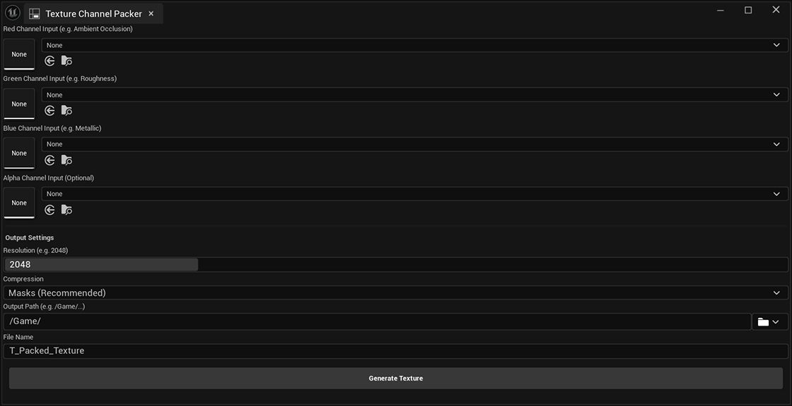

[日本語 (Japanese)](README.ja.md)

# TextureChannelPacker

[](https://www.fab.com/listings/7b231ecc-079f-45dc-9b8e-45dacc6b0771) [](LICENSE) [](https://www.unrealengine.com) [](RGBPackingTool/Plugins/TextureChannelPacker/TextureChannelPacker.uplugin) [](CHANGELOG.md)
[](https://github.com/sponsors/EmbarrassingMoment)

**TextureChannelPacker** is an Unreal Engine 5.7 plugin designed to efficiently pack separate grayscale textures into the Red, Green, Blue, and Alpha channels of a single output texture. This is commonly used for creating ORM (Occlusion, Roughness, Metallic) maps or other channel-packed textures.

>  **First time? Check out the [Quick Start Guide](QUICK_START.md) to get started in seconds!**



## Features

- **4-Channel Packing (RGBA)**: Takes up to four input textures and packs their Red channels into the output's Red, Green, Blue, and Alpha channels respectively.
- **Auto-Resizing**: Automatically resizes input textures to match the specified target resolution using High-Quality Bilinear Interpolation (`FImageUtils`).
- **Input Handling**:
  - Reads the **Red channel** from each source texture.
  - If an input texture is missing, the corresponding channel is filled with Black (0).
  - **Optional Alpha Channel**: If an Alpha texture is assigned, its Red channel is used. If left empty, the Alpha channel defaults to White (255) for full opacity.
- **Extended Format Support**:
  - Supports **16-bit Grayscale** and **32-bit Float (SDF)** source formats, ensuring high-precision data is processed correctly without "black texture" issues.
- **Output Configuration**:
  - **Compression Settings**: Select from `Masks (Recommended)`, `Grayscale`, or `Default` via a dropdown menu.
  - Customizes Output Path, File Name, and Resolution.
  - Generates `UTexture2D` assets with `sRGB = false` (linear color).
- **High Performance**:
  - Utilizes **Parallel Processing** (multi-threading) to significantly speed up texture resizing and conversion.
- **User Interface**:
  - **UI Localization**: The interface automatically switches between English and Japanese based on the Editor's language preference.
  - **Cancellable Progress**: A progress dialog with a cancel button appears during generation, allowing you to abort long operations.
  - **Path Picker**: Easily select the output directory from the Content Browser using the folder icon button.
  - **Toast Notifications**: Provides clear feedback (Success/Error) via non-intrusive notifications instead of just log messages.
  - Integrated into the Unreal Engine Editor via the **Tools** menu.

## Requirements

- **Unreal Engine 5.5+** (Developed and tested on 5.7)
- C++ Project (to compile the plugin)

## Why use this tool?

- **Texture Samplers Limit**: Materials have a limit on how many textures they can read simultaneously (usually 16). Packing 3 textures (AO, Roughness, Metallic) into 1 saves sampler slots, avoiding material errors.
- **Memory Efficiency**: Combining files reduces the memory overhead compared to loading multiple separate files.
- **File Management**: It keeps the Content Browser organized by reducing the file count.

## Supported Input Formats

The tool supports a variety of source texture formats, ensuring compatibility with different workflows:

- **8-bit**: `BGRA8`, `Gray8 (G8)` - Standard texture formats.
- **16-bit**: `Gray16 (G16)` - Useful for **Heightmaps** requiring higher precision.
- **Float**: `R16F`, `R32F`, `RGBA32F` - Useful for **SDFs (Signed Distance Fields)** and **LUTs**.

## Limitations

- **Floating Point Textures**: Floating point textures (e.g., SDF, Heightmaps) are **clamped** to the `0.0 - 1.0` range during packing. Values outside this range will be clipped.

## Installation

### Option A: Install via Fab (Recommended)
The easiest way to install is via the Fab Store. This ensures you get the correct version for your engine.
[**Get it on Fab**](https://www.fab.com/listings/7b231ecc-079f-45dc-9b8e-45dacc6b0771)

### Option B: Manual Installation (GitHub)
If you want the latest development version or need to modify the source code:

1. **Clone or Download**:
   Download this repository and place the `TextureChannelPacker` folder into your project's `Plugins` directory.
   - If the `Plugins` folder does not exist, create it in your project's root directory (next to `.uproject`).

   Directory structure:
   ```
   MyProject/
   ├── MyProject.uproject
   ├── Plugins/
   │   └── TextureChannelPacker/
   │       ├── TextureChannelPacker.uplugin
   │       └── Source/
   └── Source/
   ```

2. **Generate Project Files**:
   Right-click on your `.uproject` file and select **Generate Visual Studio project files**.

3. **Build the Project**:
   Open the generated `.sln` file in your IDE (e.g., Visual Studio or Rider) and build your project. This will compile the plugin.

4. **Enable the Plugin**:
   Launch the Unreal Engine Editor. If the plugin is not enabled automatically, go to **Edit > Plugins**, search for **TextureChannelPacker**, and enable it. Restart the editor if prompted.

## Usage Guide

1. **Open the Tool**:
   In the Unreal Editor, navigate to the main menu bar and select **Tools > Texture Packing**. This will open the Texture Channel Packer tab. You can dock this tab anywhere in your editor layout.

2. **Assign Inputs**:
   - **Red Channel Input**: Select a texture for the Red channel (e.g., Ambient Occlusion).
   - **Green Channel Input**: Select a texture for the Green channel (e.g., Roughness).
   - **Blue Channel Input**: Select a texture for the Blue channel (e.g., Metallic).
   - **Alpha Channel Input** (Optional): Select a texture for the Alpha channel. If empty, it defaults to White (255).

   *Note: You can **Drag & Drop** textures directly from the Content Browser into the slots. You can also leave any input empty; R/G/B channels will be filled with black if missing.*

3. **Configure Output**:
   - **Resolution**: Set the target resolution for the output texture (e.g., 2048).
   - **Compression Settings**: Choose the compression type (default is `Masks`).
   - **Output Path**: Specify the game folder path. You can type it manually or click the **Folder Icon** to select a directory from the Content Browser.
   - **File Name**: Enter the desired name for the new texture asset.

4. **Generate**:
   Click the **Generate Texture** button.
   - The tool will process the textures and create a new asset in the Content Browser at the specified location.
   - A Toast Notification will confirm if the operation was successful.

## Compression Settings Explained

| Setting | Best For | Description |
| :--- | :--- | :--- |
| **Masks (Recommended)** | **ORM Maps**, Packed Masks | Disables sRGB. Prevents color artifacts between channels. Best for standard PBR workflows. |
| **Grayscale** | **Height Maps**, Single Masks | Keeps values linear. Good for single-channel data. |
| **Default** | Color Textures | Standard compression. Usually for Albedo/Diffuse. Not recommended for channel packing. |

## FAQ

**Q: Can I use this plugin at runtime (in-game)?**
**A:** No, this is an **Editor-only** tool designed for asset creation during development. It does not run in packaged games.

**Q: Do input textures need to be the same resolution?**
**A:** No. The tool automatically resizes all inputs (e.g., mixing 1024p and 2048p sources) to match your specified target resolution using high-quality sampling.

**Q: What happens if I leave a slot empty?**
**A:**
* **Red, Green, Blue:** Filled with **Black (0)**.
* **Alpha:** Filled with **White (255 / Opaque)** by default, so you don't need to create a dummy white texture for opacity.

**Q: Why is 'sRGB' disabled on the output texture?**
**A:** Channel-packed textures (like ORM maps) contain data, not color, so they must be Linear (sRGB = false). This tool automatically applies the correct settings (Compression: Masks) for you.

**Q: Does it support high-resolution textures like 8K?**
**A:** Yes. The processing pipeline uses memory-optimized techniques to safely handle large assets like 4K and 8K textures.

**Q: What input formats are supported?**
**A:** It supports standard formats (PNG, TGA, PSD) as well as **16-bit Grayscale** and **32-bit Float (e.g., EXR)** formats, ensuring high precision for Heightmaps and SDFs.

## License

This project is licensed under the MIT License. See the [LICENSE](LICENSE) file for details.
